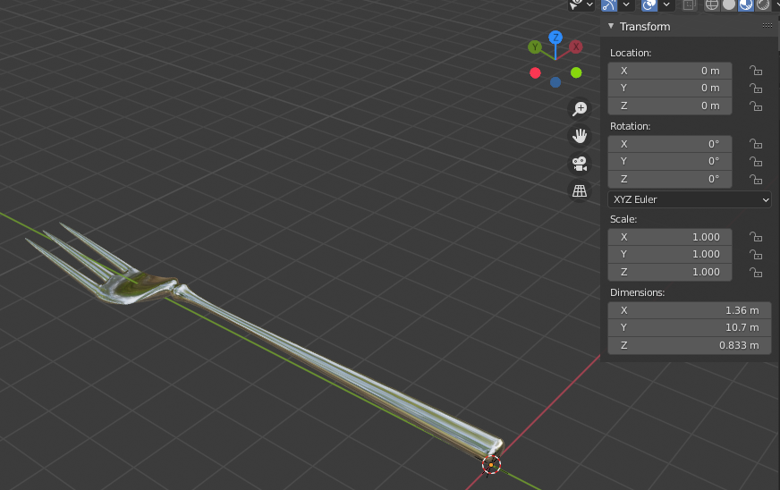
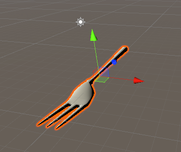
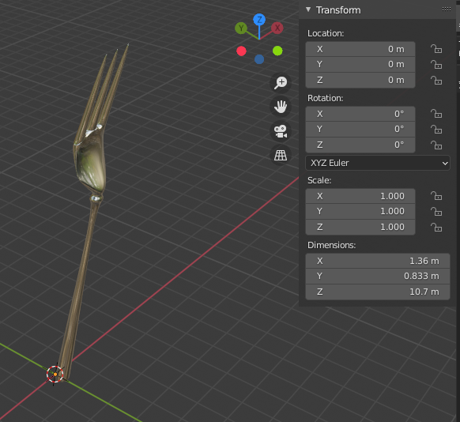
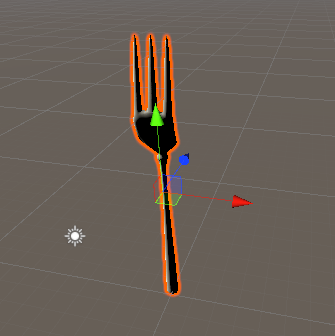

# モデリング

## 概要

* Blender の-Y方向が、Unity +Z方向
* モデリングするときは、鉛直上向きは気にしなくてよい

## 座標系の確認

* Blender
	* Apply Transform にチェックをいれて書き出し

* Unity

	* Y軸周りに180度回転しているぽい
	* +Y方向が、-Z方向に対応

* Blender の回転（右回りが正）

* フォークを立てて、再度書き出し

* Unity で書き出し

