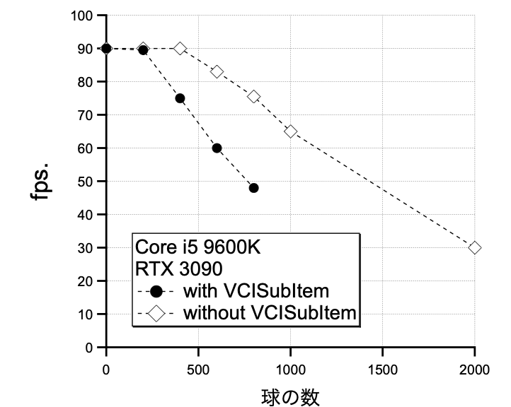
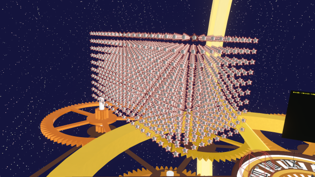
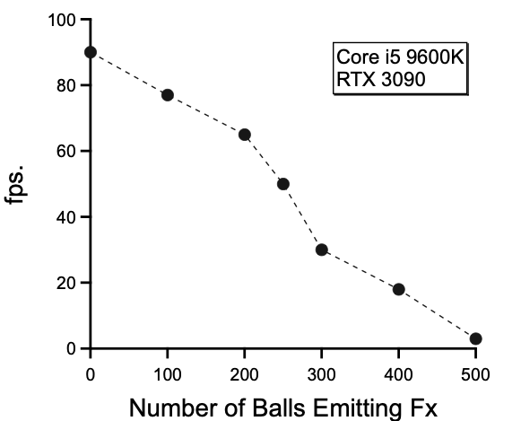
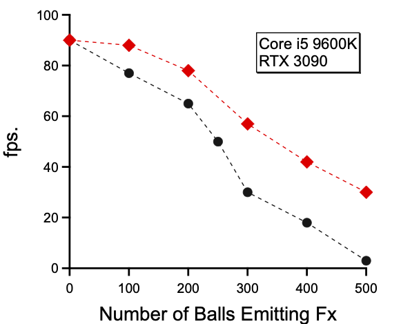
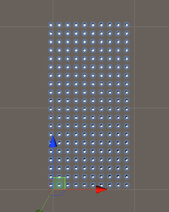
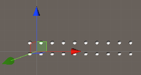
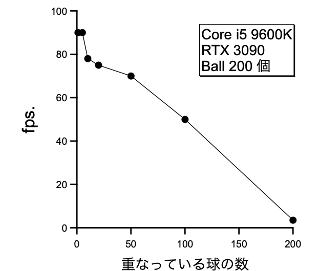
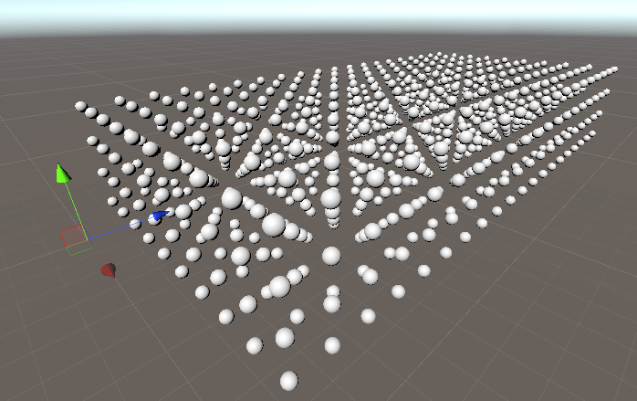
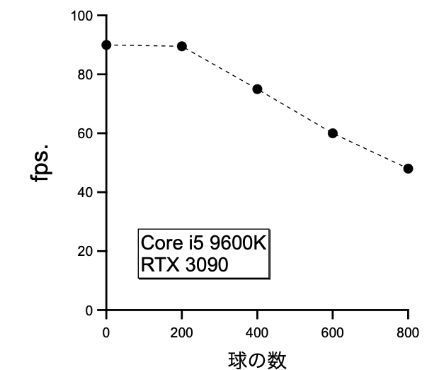

# fps. 低下条件に関する調査結果

## はじめに

* Vキャスで弾幕表現を行うために、Vキャスの基本的な挙動を確認しておく。
* 大量のアイテムを出した場合、fps.が低下することが考えられる。
* fps.が低下する条件と、どの程度低下するかを明らかにしたい。

## 実験環境

* マシン
	* CPU: Core i5 9600K
	* RAM: 32GB
	* GPU: RTX 3090
	* 回線: download 15 Mbps. / upload 80 Mbps.
* ソフト
	* VirtualCast 2.0.4g
	* UniVCI 0.31.1
	* Unity 2019.4.14f1

## 結論

* コライダーが重なるとfps.が低下する。
	* IsTriggerにチェックが付いていても低下。
* VCISubItemを付けるとfps.が低下する。
* fpsの球数依存性について、下記表と図を得た。
	* 80KBの画像を回転させるEffekseerを付けた球をprefab化
	* 大量に生成し、コライダーが重ならないように配置。

|項目|VCISubItem あり|VCISubItem なし|
|---|--------------|--------------|
|fps.が低下し始める個数| 200個        | 400個         |
|召喚できる球の個数| 1,000個未満（800個まで実測） | 推定3,000個（2,000個まで実測） |

* 点線は guide for eyes。

* （参考）球の2,000個の召喚例

# 以下、実験ノート

## 実験 1

* 80 KB の png 画像1枚を回転させるエフェクトを5種類作成。
* Sphere を5個作成し、各エフェクトをそれぞれに貼り付けた。
* Effekseer Emitter を下記のように指定。
	* Play on Star にチェック。
	* Is Looping にチェック。
* 下記コンポーネントを追加
	* Sphere Collider (Is Triggerにチェック)
	* Rigidbody (Is Kinematic にチェック)
	* VCI SubItem
* Prefab 化し、ヒエラルキー内に大量に作成。
* VCI として書き出し、スタジオ（背景：星空に浮かぶ時計の惑星（ほし））にて召喚。
* fpsのボール数依存性を調査。

## 結果

* 250 個ぐらいから急にfpsが低下。
* CPU, GPUの計算リソースは余っている。
* 別の要因がありそう（情報求む）。

## 実験 2 & 結果

* 実験1で作成した下記2個のVCIを同スタジオで召喚
	* 弾100個/VCI x1 VCI
	* 弾200個/VCI x1 VCI
* 合計 300個の弾幕が出ているが、fps 60 程度。 
* 1つのVCIのSubItem数が多い時に、fps が悪化する可能性が示唆される。

## 実験 3 & 結果

* 弾100個のVCIを複数個召喚し、fpsの弾数依存性を調査。
	* 結果を赤色で示す。
	* 黒色のマーカーは実験1の結果。

* 100個/VCI x 5VCI = 500個でも 30 fps. 程度出ている。
	* ちなみに 50個/VCI x 10VCIでも 30 fps. 程度。

* 赤と黒で同じ100個で値が違う
	* この程度の差は生じうるっぽい。
	* 見ている背景に依存？

## 実験 4 & 結果

* コライダーがIsTriggerでも、重なりによって重くなる可能性が指摘。
* 球の数を1種類200個にし、fps.の球重なり数依存性を調査。
* 球の置き方例
	* 200個ばらばら
	
	* 10個重ねる x 20 = 200個
	

* 重なっている球の数が増えるほど、fps.が低下する傾向。
* 重なっている個数が50以下では、依存性が不安定。
	* 88 fps.程度になることがあった。

## 実験 5 & 結果

* 実験4において、重ならない場合は重くならないことがわかった。
* 重ならない状態で、何個まで耐えられるか？
	* Effekseer は実験4と同様にアタッチ。
* 球の配置例と結果

* 球数が200超えたところから、球の数の増加に伴いfps.が素直に減少。
* 球数が1,000個の場合は、VCIのロードが完了しなかった。
* ゼロ外挿すると110fps.まで出せそうな気配。
	* Vキャス側でキャップされている？

## 実験 6 & 結果

* 1000個の球が読み込めないのは不思議。
* VCISubItem Componentの影響でfpsが低下している？
* 実験5の球から、VCISubItem Componentを削除。

* VCISubItem を取ると、球が1,000個のVCIも召喚できた。
* 2,000 個でも召喚でき、このときの fps.は 30 程度。
* fpsが下がっている領域からゼロ外挿すると合っていない。
	* 何らかの別の要因がまだ存在している可能性が示唆される。

## メモ

* Valve Index では、fps が上限突破可能ぽい？