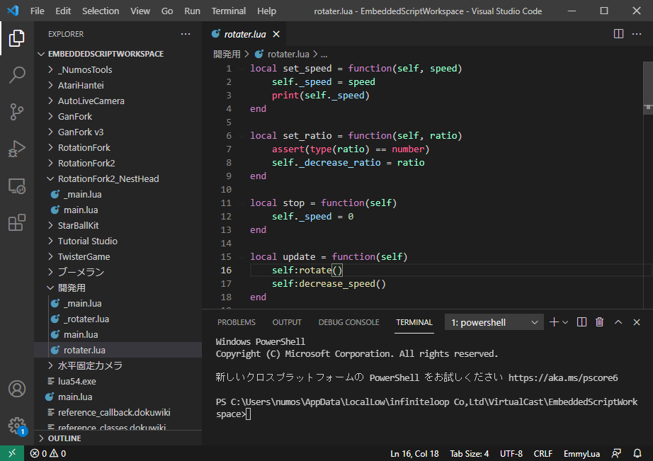

# VCI開発環境の構築

## Unity のインストール

* 公式wikiなどを参照

## VSCodeの設定

* shift + ctrl + n で 新しいワークスペースを作成
* 下記ディレクトリを開く
```
C:\Users\%USERNAME%\AppData\LocalLow\infiniteloop Co,Ltd\VirtualCast\EmbeddedScriptWorkspace
```



* 左のカラムに表示されているフォルダ名はアセット名に対応
	* vciアイテム召喚でディレクトリが作成される
	* 名前被ってたらどうなるんだろう？

## Blender のインストール（オプション）

* 3Dモデルをがっつり作成する場合はインストールしておく
	* [最新版のダウンロードページ](https://www.blender.org/download/)
	* [安定版のダウンロードページ](https://www.blender.org/download/lts/)

## Lua バイナリの配置（オプション）

* Vキャス内ではなく、PC上でデバッグしたい場合。
* 必要に応じて luaのバイナリを EmbeddedScriptWorkspace 置いておく。
	* [luaの環境構築](../lua/how_to_create_lua_env/) を参照。
* VSCode、ctrl + @ でコンソールを出す。