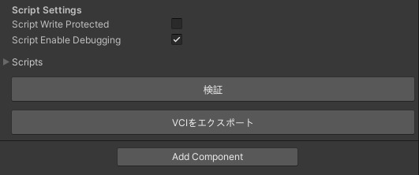
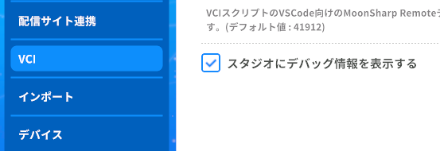

# VCIの作り方

## はじめに

* [この動画](https://www.nicovideo.jp/watch/sm36242065)がわかりやすかった
* 以下では概要をメモ。

## VCIを作成

* Unity で VCI の元になるアイテムを作成
* VCIを出力
	* Script Settings の「Script Enable Debugging」 に チェック
	* 
* TheSeedOnline に VCI をアップロード

## VC内でアイテムを召喚

* Virtual Cast を起動
* 左上の歯車 > VCI メニュー
	* 「スタジオにデバッグ情報を表示する」にチェック
	* 
* スタジオに入室
* VCIアイテムを召喚

## コーディング

* VR ゴーグルを外す
* 下記ディレクトリに移動
```
C:\Users\%USERNAME%\AppData\LocalLow\infiniteloop Co,Ltd\VirtualCast\EmbeddedScriptWorkspace
```
* template.lua を 召喚した VCI アイテムのディレクトリに移動
* main.lua にリネーム
* main.lua を編集して機能を実装する。
* main.lua を保存するたびに、VR空間上のアイテムに機能が反映される。

## Unity での作業

* VCIアイテムにソースを埋め込む
	* VCI Object > Scripts を表示
	* size を 0 から 1 に変える
	* VCI Object > Scripts の入力欄が増える
	* VCI Object > Scripts > Source に main.lua の中身をコピペ
* Script Settings の「Script Enable Debugging」 の チェックを外す
* VCIを書き出す