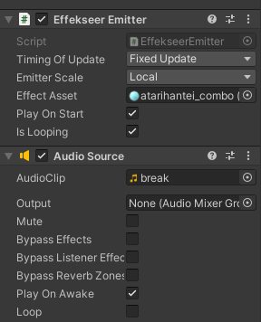

# FxControlHelper

## 概要

* EffekseerとAudioを簡単にコントロールできるクラス
* エフェクトとサウンド、どちらか片方しか使わない場合も使用可能

## 使用準備

* Effekseer
	* Effekseer ファイルをUnityのProjectフォルダに入れる
	* VCISubItem に Effekseerをアタッチ
* AudioClip
	* wav か mp3 ファイルをUnityのProjectフォルダに入れる
	* VCISubItem に アタッチ
* アタッチした例
	* 
* Unity で VCI Object の設定を変える
	* Script Size を 2 にする
	* Name を それぞれ main と fx_control_helper にする
* main.lua と同じディレクトリに fx_control_helper.lua を配置
	* Workspace 以下のディレクトリ構造は、下記のようになるはず
```
your_VCI_directory/
├ fx_control_helper.lua
└ main.lua
```

## 使用方法

```lua
local FxControlHelper = require "fx_control_helper"
local fx_controller = FxControlHelper:new()

-- # Effekseer の設定
fx_controller:set_effect("vci_subitem_name")
fx_controller:disable_effect_loop()	-- １回だけ再生する場合

-- # AudioClip の設定
fx_controller:set_sound("audio_clip_name")
fx_controller:set_sound_volume(0.5)
fx_controller:disable_sound_loop()	-- １回だけ再生する場合

is_playing = false

function onUse(use)
	if not is_playing then
		fx_controller:play_effect() -- エフェクトの再生
		fx_controller:play_sound() -- サウンドの再生
		is_playing = true
	else 
		fx_controller:stop_effect() -- エフェクトの停止
		fx_controller:stop_sound() -- サウンドの停止
		is_playing = false
	end
end

```


## 詳細な使い方

### 初期化
```lua
local FxControlHelper = require "fx_control_helper"
local fx_controller = FxControlHelper:new()
```

### エフェクトの設定

* Effekseer をアタッチした VCI SubItem 名を set_effectで指定する。
```lua
fx_controller:set_effect("vci_subitem_name")
```
* エフェクトをループ再生する場合
```lua
fx_controller:enable_effect_loop()
```
* エフェクトを１回だけ再生する場合
```lua
fx_controller:disable_effect_loop()
```

### AudioClip の設定

* VCI SubItem にアタッチしたしたAudioClipファイル名を指定する

```lua
fx_controller:set_sound("audio_clip_name") -- #上の画像例では break
```

* ボリュームを指定する（0-1の範囲）
```lua
fx_controller:set_sound_volume(0.5)
```

* AudioClipをループ再生する場合
``` lua
fx_controller:enable_sound_loop()
```

* AudioClipを１回だけ再生する場合
``` lua
fx_controller:disable_sound_loop()
```

### 再生

* Effekseer と AudioClip が指定されているものを再生
* set関数で指定されていないFxは再生しない

```lua
fx_controller:play()
```

* Effekseer のみを再生
```lua
fx_controller:play_effect()
```

* AudioClip のみを再生
```lua
fx_controller:play_sound()
```

### 停止

* Effekseer と AudioClip が指定されているものを停止
* set関数で指定されていないFxは停止しない

```lua
fx_controller:stop()
```

* Effekseer のみを停止
```lua
fx_controller:stop_effect()
```

* AudioClip のみを停止
```lua
fx_controller:stop_sound()
```

